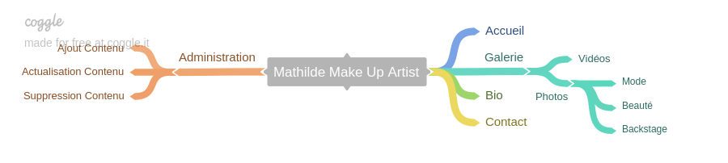

# Mathilde Make Up Artist

## Expression du Besoins

1. Le site internet sera Responsive, c-a-d s'adapte au support Bureau, Tablettes et Smartphones.
2. Le site internet sera développé dans une optique "Mobile First", C'est a dire en privilégiant le rendu sur mobile dans un premier temps, étant donné que c'est le support le plus contraignant, que ce soit pour la taille de l'écran, la puissance des appareils et leur connexions internets plus restreintes.
3. Le contenu du site web pourra être administré à l'aide d'une interface graphique accessible via un compte Administrateur.
4. De nouveaux contenus Photos et Vidéos pourront être ajoutés par le biais de ce "Back-office" ( interface graphique d'Administration ).
5. Les contenus existant, à savoir, photos, vidéos, texte de biographie et liens de contact, pourront être modifiés par le biais de ce "Back-office".
6. L'affichage des Photos sur Tablettes et Bureau se fera avec une "Masonry" ( Effet Patchwork ).
7. Au clique sur une photo, celle-ci s'afficherai un pleine écran, et l'utilisateur pourrai les faire défiler en restant en plein écran.
7. Design épuré : Texte en Blanc sur Fond Noir. Police Poiret-One.

## Questions ?
1. ###### Accueil
 Tu me dit qu'il n'y aura pas de photos sur la page d'accueil, quel serait le contenu de cette page d'Accueil du coup ?
2 options ici :
 * Sans page d'accueil, on arrive directement sur la Galerie photo et l'utilisateur rentre dans le vif du sujet.
 * Une page d'accueil avec une courte description de toi et de ton travail et une photo "à la une".
2. ###### Video
l'Intégration des vidéos se fera t'elle par le biais d'une chaine YouTube ou doit elle être Native et spécifique au site internet ?
  * Si ce sont seulement des liens, serons t'il uniquement des liens vers YouTube, ou une autre plateforme équivalente, ou bien des liens vers d'autres site tiers? Car la miniature doit être géré par le site Tiers, dans le cas de YouTube ou d'autre plateforme de ce type elle existera surement, sinon si c'est d'autre site tiers, c'est moins sur.
  * Une autre option serait de ne pas séparer les Photos et Vidéos en deux onglets distinct, mais de les inclures sur la même page, les vidéos étant différiencer grace à un boutton "PLAY >>" Bien visible. C'est une solution qui conviendrait si toute les vidéos sont sur une chaine YouTube par exemple.
3. ###### Deadline
  La question qui tue, pour quand aimerai tu avoir le site ?  µ
  Sachant que moi, je passe un examen fin Janvier, et que j'ai un projet de certif a monter pour cette date. C'est donc ma priorité :). Je peux quand même faire avancer ton site internet, mais je ne pourrai pas y consacrer énormément de temps ! ^^.

## Déroulement du Dévelopement
Dans un premier temps je metterai bien de coté ce qui concerne la vidéo et la Masonry (Effet Patchwork), pour me focaliser sur l'interface d'administration et l'affichage de Photos.

Voila ce que moi j'en ai compris ! N'hésite pas à me dire si j'ai compris quelque chose de travers, ou bien si j'ai oublier des bouts.
Peut être s'organiser un rendez-vous ( téléphonique ? ), pour éclaircir certain point plus rapidement ?! :D
